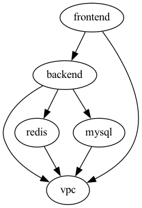

# Dependencies

- backend-app depends on mysql, redis, and vpc
- frontend-app depends on backend-app and vpc
- mysql depends on vpc
- redis depends on vpc
- vpc has no dependencies

```bash
terragrunt graph-dependencies | dot -Tpng > dependencies.png
```



------------------------------------

## Run it

```bash
export TERRAGRUNT_PARALLELISM=4

terragrunt run-all plan
terragrunt run-all apply
```

<br/>

#### Includes backend and the ones it depends on

```bash
terragrunt run-all \
  --terragrunt-include-external-dependencies \
  --terragrunt-working-dir ./backend \
  apply
```

<br/>

