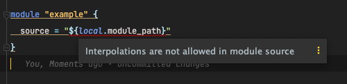

# Terragrunt module sources

They are pretty much the same, with the exception that they allow dynamic sources
and they represent the root terraform module. (so 1 per terragrunt)

**Terraform module**

